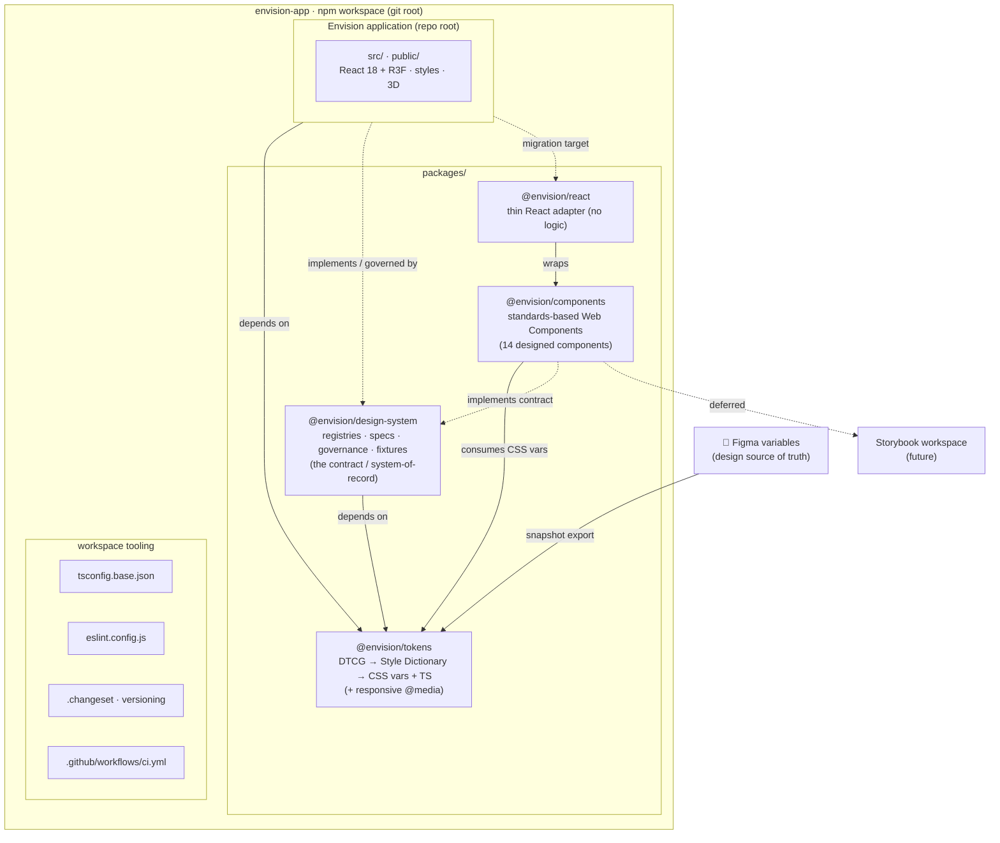

# Envision — Repository Architecture

Envision is a design system **and** the product that consumes it. This document describes
how the repository is structured as an **npm-workspaces monorepo** so the design system is
built, tested, versioned, and consumed as real packages — while the working product and the
established design-system architecture (3-tier DTCG tokens, machine-readable registries,
governance) are preserved.

The guiding principle is **incremental extraction, not a big-bang rewrite**: we extracted the
stable, low-coupling layers (tokens, the system-of-record) into packages the app depends on,
and sequenced the higher-risk work (component extraction, token-naming reconciliation) with
an explicit migration path. See [`docs/adr/0001-monorepo-and-package-boundaries.md`](./docs/adr/0001-monorepo-and-package-boundaries.md).

---

## 1. Final repository architecture

```
envision-app/                      # git root · npm workspace · the Envision application
├── package.json                   # workspace root + app manifest (workspaces: ["packages/*"])
├── tsconfig.base.json             # shared TypeScript base (paths → @envision/*)
├── eslint.config.js               # flat ESLint config (enforced on packages/*)
├── .editorconfig
├── .changeset/                    # package versioning (Changesets)
├── .github/workflows/ci.yml       # CI: design-system (blocking) + app (advisory)
├── index.html · vite.config.ts · tsconfig.json   # app entry + config
├── src/                           # ★ ENVISION APPLICATION CODE (React 18 + React-Three-Fiber)
│   ├── components/                #   product components (consume tokens; some are DS-registered)
│   ├── styles/                    #   app styles (currently include a legacy in-app token CSS copy)
│   ├── three/ · Envision/ · data/ #   app-specific 3D scene, config, data
├── public/                        # app static assets (GLB models, images)
├── packages/
│   ├── tokens/                    # @envision/tokens        — token pipeline + built CSS/TS artifacts
│   │   ├── src/                   #   DTCG source + Figma snapshot + build-dtcg
│   │   ├── lib/ · sd.build.mjs    #   Style Dictionary build + responsive emit
│   │   ├── test/                  #   token validation + integration tests
│   │   ├── dist/                  #   built, committed, diffable output (css + ts)
│   │   └── TOKEN-PIPELINE.md
│   └── design-system/             # @envision/design-system — system-of-record (the contract)
│       ├── component-registry.json · page-recipes.json · content-models.json
│       ├── state-model.json · pattern-registry.json · figma-code-map.json
│       ├── SYSTEM_SPEC.md · CLAUDE.md · GOVERNANCE.md · ACCESSIBILITY.md · …
│       └── fixtures/
└── docs/adr/                      # architecture decision records
```

### Repository & dependency diagram



Solid arrows = implemented dependencies. Dashed = the sequenced, documented next steps.
`@envision/components` and `@envision/react` are now **implemented** (see
`packages/components/ARCHITECTURE.md`); only Storybook and the app→adapter migration remain staged.

---

## 2. Responsibility of every major package / application

| Package / app | Responsibility | Depends on |
|---|---|---|
| **`@envision/tokens`** (`packages/tokens`) | The single source of built design decisions. Turns the Figma variable snapshot into DTCG token files (aliases preserved), then Style Dictionary output: CSS custom properties (primitive→semantic→component chain + responsive `@media`) and typed TS/JS. Owns the token build + token tests. **Leaf of the graph.** | — (dev: `style-dictionary`) |
| **`@envision/design-system`** (`packages/design-system`) | The **system-of-record / contract**: machine-readable registries (component-registry, page-recipes, content/state models, figma-code-map, pattern-registry) + human governance/spec/accessibility docs + fixtures. Defines *what components exist, their APIs, states, allowed compositions, and the rules* every consumer must follow (`CLAUDE.md`, `SYSTEM_SPEC.md`). Ships no runtime code today. | `@envision/tokens` |
| **`envision-app`** (repo root, `src/`) | The Envision product — the 3D kitchen/home visualizer (React 18 + React-Three-Fiber). The primary **consumer**. Renders UI from tokens and implements the DS-registered components governed by `@envision/design-system`. | `@envision/tokens`, `@envision/design-system` |
| **Workspace tooling** (root) | `tsconfig.base.json` (shared compiler options + `@envision/*` path mapping), `eslint.config.js` (flat, enforced on packages), `.changeset/` (independent semver per package), `.github/workflows/ci.yml`. | — |

### Deferred packages (defined, not yet built — see §8 and the ADR)
| Future package | Responsibility | Why deferred |
|---|---|---|
| `@envision/components` | Framework component library implementing the registry — the reusable UI extracted from `src/components`. | Extraction = rewriting the product's component boundaries; sequenced after the token consumption is reconciled, to avoid destabilizing a live product. |
| `@envision/react` (adapter) | React bindings/wrappers over a framework-agnostic core, enabling other frameworks later. | Only needed once a second framework/consumer is real. YAGNI until then. |
| `@envision/utils` | Shared framework-agnostic helpers used by components/app. | Extract on first genuine cross-package reuse, not speculatively. |
| **Storybook** workspace | Executable component reference / states / visual + a11y testing surface. | Storybook needs the extracted `@envision/components` to be meaningful; its home and role are defined, activation follows component extraction. |

---

## 3. Dependency relationships

```
@envision/tokens          →  (leaf)                     # framework-agnostic; devDep style-dictionary only
@envision/design-system   →  @envision/tokens           # the contract references token roles
envision-app (root)       →  @envision/tokens           # consumes CSS vars + typed values
envision-app (root)       →  @envision/design-system    # implements the registry/governance contract
```

**Rules that keep the graph healthy:**
- **Acyclic, one direction:** `app → design-system → tokens`. Tokens never import upward; the app never re-defines tokens.
- **Tokens is the root** everything resolves to; **the app is a pure leaf consumer.**
- Workspace links (`npm install` symlinks `node_modules/@envision/* → packages/*`) mean changes propagate without publishing.
- Future `@envision/components` slots between the app and tokens (`app → components → tokens`), and Storybook consumes `components`.

---

## 4. Local development workflow

```bash
npm install                 # once — links all workspaces
npm run dev                 # run the Envision app (Vite, 127.0.0.1:5173)

# Working on tokens (after re-exporting the Figma snapshot into packages/tokens/src/_figma-export.txt):
npm run tokens              # rebuild DTCG + CSS/TS (delegates to @envision/tokens)
npm run test:tokens         # validate + test the generated output
npm run tokens:verify       # build then test

# Quality:
npx eslint packages         # lint the design-system packages (enforced)
npm run typecheck           # app + packages TypeScript
```

Editing a token = edit the **Figma snapshot** (`packages/tokens/src/_figma-export.txt`, produced from Figma), then `npm run tokens`. Never hand-edit `packages/tokens/dist/**` (generated) or add raw values in the app (consume `--envision-t2-*` / `--envision-t3-*`).

---

## 5. Build workflow

- **Tokens (independent):** `npm run tokens` → `build-dtcg.mjs` (snapshot → DTCG) → `sd.build.mjs` (Style Dictionary → `dist/*.css` + `dist/tokens.{js,d.ts}` + responsive `@media`). Builds with zero app coupling. `dist/` is **committed** so token changes are diffable in PRs and consumers need no build step.
- **App:** `npm run build` → `tsc --noEmit` + `vite build` → `dist/`. Consumes the token package.
- **Independent builds where useful:** the token package (a) builds and tests on its own, (b) is the only thing rebuilt when Figma changes, (c) can be published independently later. The app builds/deploys on its own cadence.
- **Deploy (unchanged):** the app is deployed to Cloudflare Pages — `npx wrangler pages deploy dist --project-name envision --branch main` — on request. The restructure left the app's root `dist/` and this command intact.

---

## 6. Test workflow

- **Tokens:** `npm run test:tokens` — pure unit tests of the responsive validator (`packages/tokens/lib/responsive.mjs`) + integration assertions against the generated CSS (default in `:root`, mobile override in `@media`, no-op tokens excluded, breakpoint derived). 13 assertions, deterministic.
- **App:** no tests yet. **Vitest** is the intended runner, colocated with components (`*.test.tsx`); it activates alongside `@envision/components`.
- **CI** (`.github/workflows/ci.yml`) — two jobs:
  - **`design-system` (blocking):** `npm ci` → `npm run tokens` → **token drift check** (`git diff --exit-code packages/tokens/dist` — committed output must match source) → `npm run test:tokens` → lint packages.
  - **`app` (advisory):** typecheck / lint / build with `continue-on-error` while the app's pre-existing TypeScript + lint debt is burned down, then promoted to blocking.

---

## 7. How Envision consumes the design system

- **Tokens.** The app is already heavily tokenized (~400 `var(--envision-*)` usages). It declares a workspace dependency on `@envision/tokens`. **Current state:** the app `@import`s an in-app copy of the token CSS (`src/styles/*.css`) that uses an older `--envision-theme-*` naming, which predates the current pipeline's `--envision-t1/t2/t3-*` output. **Target:** `@import '@envision/tokens/css'`. The last-mile switch requires a **token-naming reconciliation** (either the pipeline emits a compatibility naming, or the app migrates its variable references) — deliberately **out of scope for this repository restructure**, since the token architecture is frozen. This is the single highest-value follow-up and is tracked in the tokens README + ADR.
- **Components.** The DS-registered components (per `@envision/design-system/component-registry.json`) are implemented today in `src/components`, governed by `@envision/design-system` (`CLAUDE.md` enforces: use existing components, tokenized values only, no bespoke chrome, follow page-recipes). They are not *duplicated* elsewhere (single implementation) — extracting them into `@envision/components` is the mechanism by which **other** consumers would reuse them (§8).

In short: the **package boundary and dependency graph are real now**; the token-CSS wire-up and component extraction are the two sequenced migrations, each documented with its rationale.

---

## 8. How additional consumers could be introduced later

- **A second application** (e.g. an admin app, a marketing site): add `apps/<name>` to the workspace (or a separate repo) and depend on `@envision/tokens` (+ `@envision/components` once extracted). The token package is already framework-agnostic (CSS custom properties + typed JS), so any web stack consumes it unchanged.
- **A framework adapter:** extract `@envision/components` as a framework-agnostic core, then add `@envision/react` (and later `@envision/vue`, etc.) as thin binding layers. The registry/contract already exists in `@envision/design-system`, so adapters implement against a defined API.
- **External / third-party consumers:** drop `"private": true` on `@envision/tokens`, point Changesets at a registry, and publish versioned releases; consumers `npm install @envision/tokens`.
- **Non-web platforms (iOS/Android/RN):** add Style Dictionary platforms to `packages/tokens/sd.build.mjs` — the same DTCG source emits Swift / Android XML / React-Native objects. No new source of truth.
- **CMS / no-code / design tools:** surface a curated subset of Tier-2 tokens; the DTCG source + registries are the machine-readable contract those integrations read.

Each of these plugs into the **existing** graph (`consumer → components → tokens`, all governed by `design-system`) — no restructuring required, which is the point of extracting the boundaries now.
