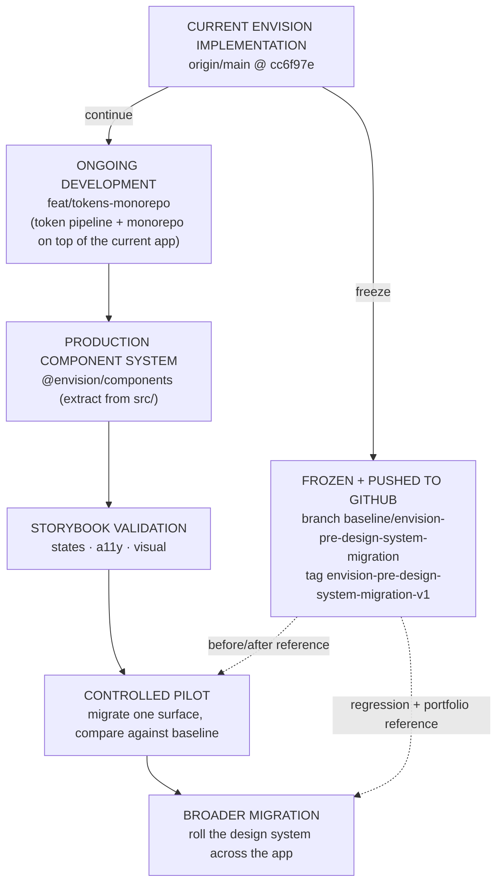

# Envision — Pre-Design-System Migration Baseline

A permanent, remotely-backed-up snapshot of the completed Envision application **before** the
production Envision Design System is applied to its UI. It exists for restoration, visual
before/after comparison, regression reference, and portfolio documentation.

## Facts

| | |
|---|---|
| **Baseline name** | Envision pre-design-system migration baseline |
| **GitHub repository** | https://github.com/clindenmayer1/envision-testing |
| **Baseline branch** (frozen) | `baseline/envision-pre-design-system-migration` |
| **Annotated tag** (frozen) | `envision-pre-design-system-migration-v1` |
| **Commit SHA** | `cc6f97eeafef3d0d8f45f9f200df5cd32e92030d` (`cc6f97e`) |
| **Date created** | 2026-08-08 |
| **Active development branch** | `feat/tokens-monorepo` (branches from `main`, which tracks `origin/main`) |

The baseline **branch** and the annotated **tag** point to the **same** commit
(`cc6f97e`). That commit is the tip of `origin/main` at freeze time.

## What this snapshot represents

The completed Envision **product application** exactly as it stood on `origin/main` immediately
before the design-system UI migration began — including the work that had accumulated on the
mainline: the IFC ingest/material pipeline, the Plans tab (Revit sheet push), the unified
Westlake-shell app, the source-agnostic targeting provider (SketchUp + IFC adapters), the
Revit-push receive server, lighting/studio/pose, and the accompanying architecture notes.

This is the **"before"** state for the design-system migration: the app UI as it renders
*prior* to adopting the production design system.

## What this snapshot does NOT represent

- **Not** the design-system migration itself, and **not** any migrated UI.
- **Not** the token pipeline or the npm-workspaces monorepo. Those are the *migration
  infrastructure* (`@envision/tokens`, `@envision/design-system`, `ARCHITECTURE.md`, the ADR)
  and live on the **forward** branch `feat/tokens-monorepo`, layered on top of this baseline —
  deliberately kept out of the frozen "before" snapshot.
- **Not** a future `@envision/components` library or Storybook (sequenced later — see the ADR).

## Restore / inspect the baseline

```bash
# Inspect at the exact frozen commit (detached HEAD, read-only browsing):
git fetch origin
git checkout envision-pre-design-system-migration-v1

# …or start a throwaway branch from the frozen baseline to build/run it:
git switch -c inspect-baseline baseline/envision-pre-design-system-migration

# Return to active development when done:
git switch feat/tokens-monorepo
```

The baseline is independent of any local clone: the branch and tag are pushed to GitHub, so the
snapshot survives even if this working copy is deleted.

## Migration workflow



Solid arrows = the path forward. Dashed = the baseline serving as the fixed reference the
migration is compared against.
