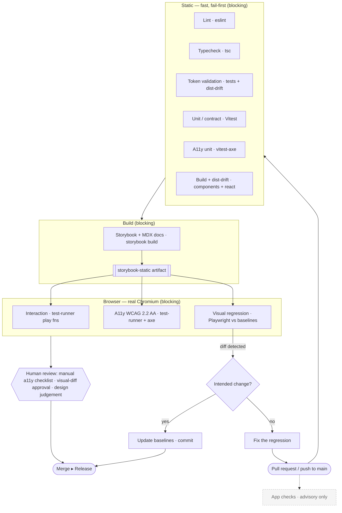

# Envision Design System — Quality Strategy

This document describes the automated quality layer that protects the Envision Design System from
regressions. The goal is to make quality **systemic and enforceable** — a property of the pipeline,
not something designers and engineers have to remember from a checklist.

Every layer is integrated into the **existing** architecture (the monorepo packages and CI), not a
parallel test system. The full pipeline runs on every pull request and on pushes to `main`.

---

## The layers

Each row: what the layer protects against · the tool · when it runs · whether failure blocks a PR
or release · what remains a human responsibility.

| # | Layer | Protects against | Tool | When | Blocks? | Human still owns |
|---|---|---|---|---|---|---|
| 1 | **Lint** | Inconsistent/unsafe code, banned patterns | ESLint + typescript-eslint | every commit / PR | **Blocks PR** | Choosing the rules; reviewing intent |
| 2 | **Type checking** | Broken component/adapter APIs, wrong prop/attr types | `tsc --noEmit` (per package) | every commit / PR | **Blocks PR** | Designing the type contracts |
| 3 | **Token validation** | Malformed tokens, broken alias chains, **committed token `dist` drifting from source** | token unit tests + `git diff` drift check | every PR | **Blocks PR** | Token architecture & naming decisions |
| 4 | **Unit / contract behaviour** | Component behaviour regressions — states, events, ARIA wiring, keyboard, form participation, content extremes | Vitest + happy-dom (80 tests) | every PR | **Blocks PR** | Deciding the intended behaviour |
| 5 | **Accessibility — unit (fast)** | ARIA / accessible-name / structure violations | `vitest-axe` (happy-dom) | every PR | **Blocks PR** | Everything axe can’t see (see below) |
| 6 | **Component + adapter build** | Un-buildable code; committed `dist` not matching source | `tsc` + `git diff` drift check | every PR | **Blocks PR** | — |
| 7 | **Storybook / docs build** | Broken stories or MDX docs; a spec that won’t compile | `storybook build` | every PR | **Blocks PR** | Doc content & accuracy |
| 8 | **Interaction testing** | Broken keyboard / focus / activation flows | Storybook **test-runner** `play` fns (Chromium) | every PR | **Blocks PR** | Designing the interaction |
| 9 | **Accessibility — browser (WCAG 2.2 AA)** | Colour-contrast + rendered ARIA + focus visibility that unit a11y can’t evaluate | test-runner + **axe** (`@axe-core/playwright`) | every PR | **Blocks PR** (documented per-story exceptions only) | The manual-review checklist (below) |
| 10 | **Visual regression** | Unintended visual change to any component/state | Playwright `toHaveScreenshot` vs committed baselines | every PR | **Blocks PR until the diff is reviewed & approved** | Judging intended vs accidental |

**Release gate.** A release (a version bump / publish) requires the same set green on `main`, plus
the human sign-offs that automation cannot perform (manual a11y review for changed components,
visual approval of intended changes). Nothing releases red.

### What each layer maps to
- Layers 1–7 are **fast, deterministic, and headless** — CI jobs `lint-typecheck`, `tokens`,
  `unit`, `storybook-build`. They also run locally via `npm run quality`.
- Layers 8–10 are **browser** layers (CI jobs `interaction-a11y`, `visual-regression`) — they
  consume the Storybook build artifact and run in real Chromium.
- The **app** job stays **advisory** (`continue-on-error`) while the product’s pre-existing
  type/lint debt is burned down — honest, and it never blocks the design system.

---

## The pipeline



Solid path = the blocking gates. `App checks` (dashed) run in parallel but never block.

---

## What automated accessibility testing CANNOT verify (still human)

axe (unit + browser) catches roughly a third of WCAG issues — the machine-detectable ones
(missing names/roles, invalid ARIA, contrast, structure). It **cannot** confirm the system is
actually usable. WCAG 2.2 AA is the baseline; conformance still requires human review. For each
changed interactive component, a person must verify:

- **Screen-reader experience** — that the name, role, state, and changes are *announced sensibly*
  and in a sensible order (axe checks presence, not quality of the spoken result).
- **Keyboard journey end-to-end** — logical tab order across a real screen, no traps, shortcuts
  don’t collide, focus goes somewhere sensible after actions (modal open/close, delete, submit).
- **Focus visibility in context** — the ring is actually visible against the real adjacent
  surfaces and not clipped/obscured by overlapping content.
- **Meaning is not colour-only** — that ring + check + text truly convey selection/status/error
  (axe can’t judge whether a non-colour cue is *meaningful*).
- **Zoom & reflow** — 200% zoom and 400% / reflow don’t break layout or hide content.
- **Text spacing / translation** — layouts survive increased spacing and longer translated strings.
- **Reduced motion** — animations are genuinely reduced/removed, not just technically gated.
- **Forced-colors / high-contrast mode** — components remain legible and operable.
- **Touch-target size & spacing** in real layouts.
- **Cognitive/plain-language** quality of labels, errors, and instructions.

These are enumerated per component in [`ACCESSIBILITY-CONTRACTS.md`](./ACCESSIBILITY-CONTRACTS.md),
which marks each check **automated** or **manual**.

---

## Running it

```bash
# Static + build layers (headless, fast) — everything except the browser layers:
npm run quality

# Individual layers:
npm run lint · npm run test · npm run test:a11y · npm run tokens:verify · npm run build-storybook

# Browser layers (need Chromium: npx playwright install chromium):
npm run test:stories     # interaction + WCAG 2.2 AA a11y on every story
npm run visual           # visual regression vs committed baselines
npm run visual:update    # re-baseline after an INTENTIONAL visual change (then review the diff & commit)
```

See [`packages/storybook/VISUAL-REGRESSION.md`](../packages/storybook/VISUAL-REGRESSION.md) for the
visual-regression coverage, failure criteria, and baseline/approval workflow.
