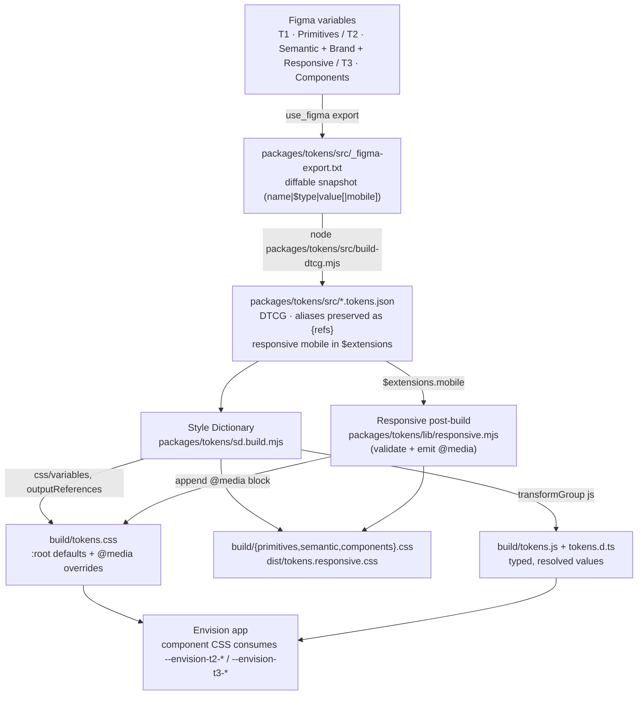

# Envision Token Pipeline

Figma is the source of truth for design decisions. This pipeline turns Figma variables
into production CSS custom properties and typed TS/JS exports, preserving the
`primitive → semantic → component` alias chain the whole way. This document describes
the pipeline and, in detail, the **responsive output layer**.

## Architecture



`npm run tokens` runs `build-dtcg.mjs` then `sd.build.mjs` (which includes the responsive
step). `npm run tokens:verify` also runs `scripts/test-tokens.mjs`.

---

## The responsive output layer

### 1. What changed
The pipeline already emitted desktop values (`$value`) with the alias chain intact. It did
**not** emit the mobile values that were captured in token metadata. It now does: the build
emits a single `@media` block that overrides the affected custom properties with their
mobile values, appended to `dist/tokens.css` (self-complete) and also written standalone to
`dist/tokens.responsive.css`. Validation was added, and `test-tokens.mjs` covers it. The
desktop `:root` output, the alias chain, naming, and the 408-token count are unchanged.

### 2. How responsive metadata is represented in DTCG
Responsive tokens keep their **desktop value as `$value`** and their **mobile override in
`$extensions`**, under the `"envision.responsive"` namespace. Values stay as references
wherever Figma expressed them as aliases:

```jsonc
"display": {
  "$type": "dimension",
  "$value": "{envision.t1.font-size.56}",          // desktop default
  "$extensions": {
    "envision.responsive": { "mobile": "{envision.t1.font-size.40}" }  // mobile override
  }
}
```
Mobile values are either a reference (`{envision.t1.…}`) or a raw value (e.g. `390`, `1`),
exactly as exported from Figma. Nothing is invented; these are the Figma responsive modes
(desktop / mobile).

### 3. How the build transforms it
- **Style Dictionary** owns the desktop layer: `css/variables` with `outputReferences: true`
  emits `:root { --…: var(--…); }`, preserving the primitive→semantic→component chain. SD
  does not read `$extensions`.
- **A deterministic post-build step** (`packages/tokens/lib/responsive.mjs`, called from
  `sd.build.mjs`) reads the DTCG files, and for every token carrying
  `$extensions["envision.responsive"].mobile`:
  1. **Validates** it (mobile present and non-empty; a reference must resolve to a real
     token) — otherwise the build throws with a per-token message.
  2. **Skips no-ops** where `mobile === $value` (e.g. `body`, `caption` don't shrink), so the
     media block is never padded with redundant declarations.
  3. **Resolves** the value: a reference becomes `var(--…)` (chain preserved); a raw
     `dimension` becomes `<n>px`; a raw `number` (grid columns) passes through.
  4. Emits the override under the **same custom-property name** (the CSS var name equals the
     dotted token path with `.`→`-`, identical to SD's `name/kebab`).

The **breakpoint is derived, not invented**: `@media (max-width: <envision.t1.breakpoint.tablet>px)`
= `1024px`, the Envision tablet primitive and the app's dominant `max-width` media query.
Since desktop/mobile is the only responsive dimension the system defines, there is exactly
one breakpoint — no extra breakpoint complexity.

### 4. What CSS is generated
```css
:root {
  --envision-t1-font-size-56: 56px;
  --envision-t1-font-size-40: 40px;
  --envision-t2-font-size-display: var(--envision-t1-font-size-56);   /* desktop default */
}

/* below the tablet breakpoint the SAME property resolves to its mobile value */
@media (max-width: 1024px) {
  :root {
    --envision-t2-font-size-display: var(--envision-t1-font-size-40);
    --envision-t2-layout-right-rail-width: 390px;
    --envision-t2-layout-page-gutter: var(--envision-t1-spacing-20);
    --envision-t2-layout-card-grid-columns: 1;
    /* …11 total overrides… */
  }
}
```

### 5. How product components consume it
Components never branch on viewport for these values. They reference the semantic/component
custom property once; the value changes automatically at the breakpoint:

```css
.hero-title { font-size: var(--envision-t2-font-size-display); } /* 56px desktop, 40px ≤1024px */
.right-rail  { width: var(--envision-t2-layout-right-rail-width); } /* 392px → 390px */
```
This matches the design-system rule that components consume Tier-2/Tier-3 tokens and never
duplicate responsive logic.

### 6. Tradeoffs / limitations
- **Post-build emit, not a native SD format.** SD has no first-class multi-mode CSS-media
  output, so the responsive block is generated by a small tested module in the same build
  command. It stays deterministic and diffable, but it is Envision-specific rather than a
  reusable SD plugin.
- **`tokens.css` is the responsive-complete artifact.** The per-tier splits
  (`semantic.css` etc.) are desktop-only; consumers composing from splits must also import
  `tokens.responsive.css`.
- **Single breakpoint by design.** The token system only encodes desktop/mobile. Adding
  tablet-specific values later would mean a second `$extensions` key + a second media block —
  intentionally deferred, not built speculatively.
- **`$extensions` values are opaque to SD** (it never resolves them), so the reference
  resolution + validation live in our code; a malformed reference is caught by our validator,
  not by SD.

## Commands
| command | does |
|---|---|
| `npm run tokens` | regenerate DTCG + all CSS/TS **including** responsive overrides |
| `npm run test:tokens` | unit-test validation + integration-check generated CSS |
| `npm run tokens:verify` | `tokens` then `test:tokens` |
